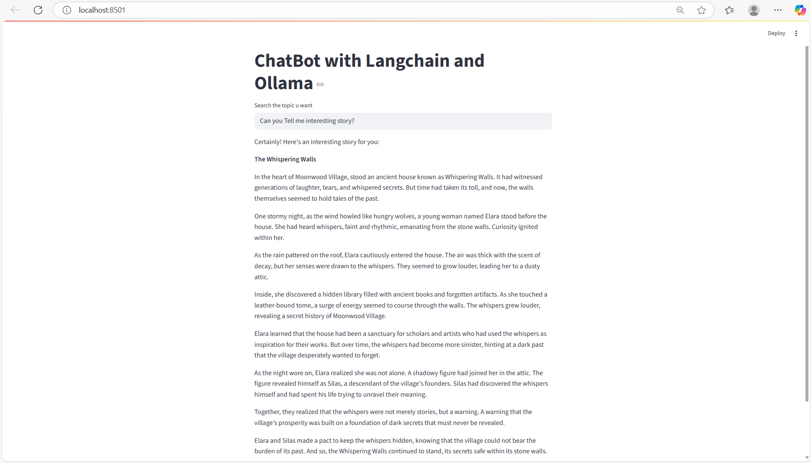

# 🌟 LangChain ChatBot with Ollama and Streamlit 🌟

Welcome to the **LangChain ChatBot** project! This is a simple yet powerful chatbot application built using **LangChain**, **Ollama**, and **Streamlit**. It allows users to interact with a locally hosted language model through a sleek web interface, providing real-time responses to queries. Integrated with **LangSmith** for tracing and monitoring, this project is perfect for exploring the capabilities of local LLMs with a user-friendly setup.

This README serves as a comprehensive guide to understanding, setting up, and running the project. It also highlights key differences from a similar project that uses **Azure OpenAI** instead of **Ollama**, helping you understand the trade-offs and benefits of each approach.

---

## 🎯 Table of Contents
- [Project Overview](#project-overview)
- [Features](#features)
- [Tech Stack](#tech-stack)
- [Key Differences from Azure OpenAI Project](#key-differences-from-azure-openai-project)
- [Setup Instructions](#setup-instructions)
- [Environment Variables](#environment-variables)
- [How It Works](#how-it-works)
- [Running the Application](#running-the-application)
- [Monitoring and Tracing with LangSmith](#monitoring-and-tracing-with-langsmith)
- [File Structure](#file-structure)
- [Contributing](#contributing)
- [License](#license)

---

## 🌍 Project Overview
This project creates a chatbot that leverages **Ollama** for local language model inference, **LangChain** for managing conversation flows, and **Streamlit** for a user-friendly web interface. Users can input queries, and the chatbot responds with answers generated by the Ollama model (e.g., `gemma`). **LangSmith** integration allows for detailed tracing of the conversation pipeline, including inputs, outputs, and performance metrics.

Unlike cloud-based solutions, this project emphasizes local computation, making it ideal for scenarios where data privacy, cost, or offline access is a priority.

---

## ✨ Features
- **Interactive Web Interface**: A clean, Streamlit-based UI for seamless user interaction.
- **Local LLM with Ollama**: Uses the `gemma` model (or other Ollama-supported models) for on-device inference, reducing dependency on cloud services.
- **LangChain Framework**: Structures the conversation flow with prompt templates, LLM calls, and output parsing.
- **LangSmith Tracing**: Monitors and debugs the application with detailed traces of inputs, outputs, and performance metrics.
- **Lightweight Setup**: Minimal dependencies and easy-to-configure environment variables.

---

## 🛠 Tech Stack
- **Python**: Core programming language.
- **LangChain**: Framework for chaining prompts, LLMs, and output parsers.
- **Ollama**: Local language model inference engine.
- **Streamlit**: Web framework for creating the UI.
- **python-dotenv**: Manages environment variables securely.
- **LangSmith**: Tool for tracing and analyzing LangChain operations.

---

## 🔄 Key Differences from Azure OpenAI Project
The provided Azure OpenAI-based project uses a cloud-hosted language model, while this project uses **Ollama** for local inference. Below is a detailed comparison to highlight the differences and their implications:

| **Feature**                        | **Ollama-Based Project (This)**                          | **Azure OpenAI-Based Project**                          |
|------------------------------------|---------------------------------------------------------|-------------------------------------------------------|
| **Language Model**                 | Local LLM (`gemma` via Ollama)                          | Cloud-hosted Azure OpenAI model                      |
| **Hosting**                        | Runs locally on your machine                            | Hosted on Azure cloud infrastructure                 |
| **Cost**                           | Free (requires sufficient local compute resources)      | Pay-per-use based on token consumption               |
| **Data Privacy**                   | Data stays on-device, ideal for sensitive applications  | Data sent to Azure, subject to cloud provider policies |
| **Setup Complexity**               | Requires Ollama installation and model download         | Requires Azure account and API key setup             |
| **Scalability**                    | Limited by local hardware (CPU/GPU)                     | Scales with Azure's cloud infrastructure             |
| **Offline Capability**             | Fully functional offline once model is downloaded       | Requires internet connection for API calls           |
| **Model Customization**            | Limited to Ollama-supported models                      | Access to a range of Azure-hosted OpenAI models      |
| **Latency**                        | Depends on local hardware; can be slower                | Generally faster due to optimized cloud servers      |
| **API Key Management**             | Only LangSmith API key (optional)                       | Requires Azure OpenAI API key, endpoint, and deployment name |
| **Use Case**                       | Prototyping, privacy-focused apps, offline use          | Production-grade apps, high scalability, enterprise use |

### Why Choose This Project?
- **Cost-Effective**: No cloud API costs, making it ideal for hobbyists, researchers, or budget-conscious developers.
- **Privacy-First**: Keep your data local, avoiding cloud provider data policies.
- **Offline Access**: Perfect for environments with limited or no internet connectivity.
- **Learning-Friendly**: Simplifies the setup for experimenting with LangChain and local LLMs.

### When to Use the Azure OpenAI Project?
- **Scalability Needs**: If you need to handle high traffic or large-scale deployments.
- **Advanced Models**: Access to cutting-edge models like GPT-4, unavailable in Ollama.
- **Enterprise Use**: When integration with Azure's ecosystem or compliance is required.

---

## 🚀 Setup Instructions
Follow these steps to set up and run the project locally:

1. **Clone the Repository**:
   ```bash
   git clone <repository-url>
   cd <repository-folder>
   ```

2. **Install Dependencies**:
   Ensure you have Python 3.8+ installed. Install the required packages:
   ```bash
   pip install -r requirements.txt
   ```

3. **Install Ollama**:
   - Download and install Ollama from [ollama.ai](https://ollama.ai/).
   - Pull the `gemma` model (or another supported model):
     ```bash
     ollama pull gemma
     ```

4. **Create a `.env` File**:
   Create a `.env` file in the project root with the following (only LangSmith is needed if tracing is enabled):
   ```plaintext
   LANGSMITH_API_KEY=<your-langsmith-api-key>
   LANGSMITH_TRACING=true
   LANGSMITH_PROJECT=ChatBot
   ```

5. **Install Python Packages**:
   Ensure the following packages are installed:
   ```plaintext
   langchain
   langchain-community
   streamlit
   python-dotenv
   ```
   Install them using:
   ```bash
   pip install langchain langchain-community streamlit python-dotenv
   ```

6. **Run the Application**:
   Start the Streamlit app:
   ```bash
   streamlit run app.py
   ```

---

## 🔑 Environment Variables
The application uses the following environment variables (in `.env`):
- `LANGSMITH_API_KEY`: Your LangSmith API key for tracing (optional).
- `LANGSMITH_TRACING`: Set to `"true"` to enable LangSmith tracing.
- `LANGSMITH_PROJECT`: The LangSmith project name (e.g., `"ChatBot"`).

Unlike the Azure OpenAI project, no API keys or endpoints are required for Ollama, as it runs locally.

---

## ⚙️ How It Works
1. **User Input**: Users enter queries via the Streamlit interface.
2. **Prompt Template**: The input is formatted using a `ChatPromptTemplate` with a system message ("You are a helpful assistant") and the user's query.
3. **Ollama Model**: The prompt is processed by the local `gemma` model via the `Ollama` class.
4. **Output Parsing**: The `StrOutputParser` extracts the text response from the model's output.
5. **Response Display**: The parsed response is shown on the Streamlit UI.
6. **LangSmith Tracing**: If enabled, LangChain operations are logged to LangSmith for analysis.

The chain (`prompt | llm | output_parser`) forms a `RunnableSequence` that processes the input sequentially, with each step traceable in LangSmith.

---

## 🖥 Running the Application
1. Ensure Ollama is running and the `gemma` model is downloaded.
2. Configure the `.env` file if using LangSmith.
3. Run the Streamlit app:
   ```bash
   streamlit run app.py
   ```
4. Open your browser to `http://localhost:8501` (or the provided URL).
5. Enter a query, and the chatbot will respond using the local Ollama model.
- _Landing Page_
  
---

## 📊 Monitoring and Tracing with LangSmith
LangSmith provides detailed insights into the application's behavior. To enable tracing:
1. Set `LANGSMITH_TRACING="true"` and provide a `LANGSMITH_API_KEY` in the `.env` file.
2. Log in to [LangSmith](https://smith.langchain.com/) and navigate to the "ChatBot" project.

### What You Can Monitor
- **Traces**: Each chain invocation creates a trace showing the flow: `RunnableSequence` → `ChatPromptTemplate` → `Ollama` → `StrOutputParser`.
- **Inputs/Outputs**:
  - **ChatPromptTemplate**: Input is the user's query; output is the formatted prompt.
  - **Ollama**: Input is the prompt; output is the model's response.
  - **StrOutputParser**: Input is the model's response; output is the plain text.
- **Performance Metrics**:
  - **Latency**: Execution time for each component and the total chain.
  - **Token Usage**: Approximate token counts for prompts and responses (if supported by Ollama).
- **Monitor Tab**: View aggregate metrics like average latency, run counts, and error rates.

This helps debug issues, optimize prompts, and understand model performance on your local hardware.

---

## 📁 File Structure
```plaintext
├── .env                    # Environment variables for LangSmith
├── app.py                  # Main script with Streamlit and LangChain logic
├── requirements.txt        # List of Python dependencies
└── README.md               # This file
```

---

## 🤝 Contributing
We welcome contributions! To contribute:
1. Fork the repository.
2. Create a feature or bug-fix branch.
3. Submit a pull request with a clear description of your changes.

---

## 📜 License
This project is licensed under the MIT License. See the [LICENSE](LICENSE) file for details.

---

🌟 **Happy Chatting!** 🌟  
Build, experiment, and explore the power of local LLMs with this LangChain-powered chatbot!